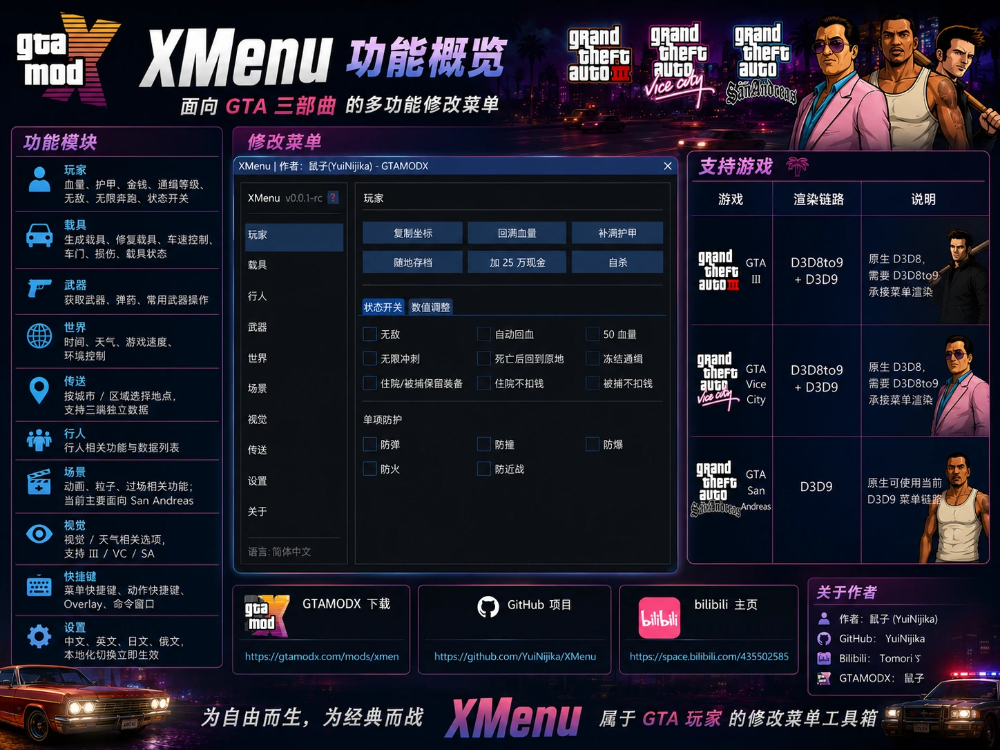

<div align="center">

# XMenu for GTA III / Vice City / San Andreas

一个简单但功能比较全面的 GTA 三部曲 ASI 菜单。  
By **鼠子(YuiNijika)**

A simple yet feature-rich ASI menu for GTA III, GTA Vice City, and GTA San Andreas.

[](https://github.com/YuiNijika/XMenu)
[](https://gtamodx.com/mods/xmenu)
[](https://space.bilibili.com/435502585)



</div>

---

## 中文

> 默认快捷键：`M` 呼出 / 关闭菜单

### 这是什么

XMenu 是一个面向 GTA III、GTA Vice City、GTA San Andreas 的 ASI 菜单，目标是安装简单、功能直观、三端共用同一套使用体验。

它不是大型整合包，也不会替换游戏主程序。把文件放到游戏目录后，通过 ASI Loader 加载即可使用。也可使用仓库附带的安装器一键部署。

当前版本字符串见源码 `XMENU_VERSION`（如 `v0.0.3-rc`）。游戏内与安装器均会检测新版本。

### 功能概览

| 模块 | 功能 |
| --- | --- |
| 玩家 | 血量、护甲、金钱、通缉等级、无敌、无限奔跑、自由飞行、状态开关 |
| 载具 | 生成载具（分类 / 手风琴长列表）、修复、车速、车门、损伤、霓虹、载具状态 |
| 武器 | 获取武器、弹药、安全模式限制无效 ID、滚轮刷武器、自定义射速；行人/车辆线框与骨骼绘制；子弹追踪 / 穿墙 |
| 世界 | 时间、天气、游戏速度、环境控制；自由相机 / 俯视相机 / 随机作弊等 |
| 传送 | 按城市 / 区域选点、快速地图 / 标记、向前传送与持续向前传送 |
| 行人 | 行人生成、相关功能与数据列表 |
| 场景 | 动画、粒子、过场相关功能；当前主要面向 San Andreas |
| 视觉 | 视觉 / 天气相关选项，支持 III / VC / SA |
| 界面 | 面板模式与 GTA 风格列表模式；列表支持键盘 + 鼠标、数值弹窗输入、子页返回；全局主题色 |
| 快捷键 | 菜单快捷键、动作快捷键、Overlay、命令窗口 |
| 设置 | 中/英/日/俄本地化即时切换；配置导入导出；Overlay 与启动状态恢复 |
| 更新 | 双源检测：优先 [GTAMODX](https://gtamodx.com/mods/xmenu)，失败回退 GitHub Releases |

#### 武器辅助说明（SA / VC）

- **绘制**：行人 / 车辆包围盒、ColModel 碰撞线框、行人骨骼（VC 对骨骼读取做了安全保护）。
- **子弹追踪**：在锁定范围内选取目标，可配置最大目标数（多目标时按发轮询）；只改子弹落点，**不会转动相机**。
- **子弹穿墙**：仅在本地玩家开火链路内软忽略建筑等遮挡。
- **自定义射速**：倍率调节，与「快速连射」相互独立，写入配置后可持久化。
- **安全模式**：默认开启，拦截无效武器 type / model ID，避免异常刷枪。
- **GTA III**：上述高级辅助目前为占位，菜单项可能可见但不会启用完整追踪逻辑。

#### 界面模式

- **面板模式**：传统窗口 + 控件布局，适合鼠标操作；可选手键焦点交互。
- **列表模式**：类原生菜单的上下选择；默认键盘 / 滚轮 / 鼠标均可；数值项可弹窗键盘输入；长列表可用折叠分组。
- 两种模式共用主题色体系，设置页可切换主题。

#### San Andreas 额外能力（摘要）

部分能力主要在 SA 链路实现，例如载具霓虹、自由相机（Freecam）、俯视相机、随机作弊、场景粒子 / 过场等。III / VC 以各自可用功能为准。

### 支持游戏

| 游戏 | 渲染链路 | 说明 |
| --- | --- | --- |
| GTA III | D3D8to9 + D3D9 | 原生 D3D8，需要 D3D8to9 承接菜单渲染 |
| GTA Vice City | D3D8to9 + D3D9 | 原生 D3D8，需要 D3D8to9 承接菜单渲染 |
| GTA San Andreas | D3D9 | 原生可使用当前 D3D9 菜单链路 |

### 运行依赖

- [DirectX End-User Runtime](https://www.microsoft.com/en-us/download/details.aspx?id=35)
- [Visual C++ Redistributable 2022 x86](https://aka.ms/vs/17/release/vc_redist.x86.exe)
- [Ultimate ASI Loader](https://github.com/ThirteenAG/Ultimate-ASI-Loader/releases)
- [SilentPatch](https://gtaforums.com/topic/669045-silentpatch/)（推荐；GTA III 可不装）
- [D3D8to9](https://github.com/crosire/d3d8to9/releases)（仅 GTA III / Vice City 需要）

### 安装

#### 方式 A：安装器（推荐）

1. 准备好游戏本体（及你已有的 MOD 环境）。
2. 运行 `XMenuInstaller.exe`，按向导选择游戏目录与组件。
3. 安装器可附带部署依赖组件（如 Ultimate ASI Loader、SilentPatch、III/VC 用 D3D8to9），也可只装 XMenu 本体。
4. 版本信息优先读 GTAMODX；下载安装包走 GitHub Release。也可手动打开 GTAMODX / GitHub 页面。
5. 启动游戏，按 `M` 打开菜单。

#### 方式 B：手动复制

1. 安装上面的运行依赖。
2. 将 `XMenu.asi` 放入游戏根目录。
3. 将 `XMenu` 文件夹放入游戏根目录。
4. GTA III / Vice City 额外放入 D3D8to9 的 `d3d8.dll`。
5. 启动游戏，按 `M` 打开菜单。

推荐目录结构：

```text
GameRoot/
├─ XMenu.asi
├─ XMenu/
│  ├─ XMenuSA.dll
│  ├─ XMenuVC.dll
│  ├─ XMenuIII.dll
│  ├─ data/
│  │  ├─ sa/
│  │  ├─ vc/
│  │  ├─ iii/
│  │  └─ i18n/
│  └─ i18n/              # 兼容旧路径，可选
└─ d3d8.dll              # 仅 GTA III / Vice City 需要
```

运行后会在游戏目录下生成（路径以实际配置为准）：

```text
XMenu/config.json
XMenu/debug.log
```

`config.json` 会保存菜单状态、快捷键、武器辅助开关与射速等可持久化项。首次启动会分帧完成 i18n / 配置 / 逻辑与 D3D Hook，减轻进档卡顿；资源 JSON 按需加载。

### 如何增加新语言

XMenu 的当前语言文件位于：

```text
XMenu/data/i18n/<language>/
```

源码内对应目录为：

```text
src/data/i18n/<language>/
```

新增语言示例：假设要增加韩文 `ko`。

1. 复制一个已有语言目录，例如：

```text
src/data/i18n/en/ -> src/data/i18n/ko/
```

2. 修改 `src/data/i18n/ko/index.json`。

通常需要确认：

```json
{
  "name": "한국어",
  "files": [
    "common.json",
    "player.json",
    "vehicle.json",
    "weapon.json",
    "world.json",
    "teleport.json",
    "ped.json",
    "scene.json",
    "visual.json",
    "actions.json",
    "settings.json",
    "update.json",
    "about.json",
    "scene_visual_data.json"
  ]
}
```

3. 翻译 `ko` 目录下的各个 JSON 文件。

只改右侧文本，不改左侧 key：

```json
{
  "tab.player": "Player"
}
```

应该改成：

```json
{
  "tab.player": "플레이어"
}
```

不要改成：

```json
{
  "탭.플레이어": "플레이어"
}
```

4. 重新构建或把语言目录放到运行目录。

开发环境构建：

```bat
Build.bat Release --no-pause
```

玩家本地临时添加语言：

```text
GameRoot/XMenu/data/i18n/ko/
```

5. 启动游戏，在设置页切换语言。

如果某个 key 没翻译，XMenu 会回退到备用语言或显示原 key，方便定位缺失项。

### 构建

环境要求概要：

- Visual Studio（含 MSVC C++ 桌面开发，Win32）
- [plugin-sdk](https://github.com/DK22Pac/plugin-sdk)（设置环境变量 `PLUGIN_SDK_DIR`，或放在上级目录由 `Build.bat` 自动探测）
- 仓库内 `tools/premake5.exe`

```bat
Build.bat Release --no-pause
```

可选参数：`Debug` / `Release`、`--toolset v143|v145`、`--no-pause`。

首次也可先运行 `Setup.bat` 协助配置 plugin-sdk 等路径。

构建产物：

```text
build/bin/XMenu.asi
build/bin/XMenuInstaller.exe
build/bin/XMenu/XMenuSA.dll
build/bin/XMenu/XMenuVC.dll
build/bin/XMenu/XMenuIII.dll
build/bin/XMenu/data/**
build/bin/XMenu/data/i18n/**
build/bin/XMenu/i18n/**
```

多语言 / 数据维护：

| 路径 | 说明 |
| --- | --- |
| `tools/build_i18n_split.py` | 拆分 / 整理 i18n 数据 |
| `tools/dataEditor/` | Python 数据编辑小工具（含多语言界面资源） |
| `tools/build_plugin_sdk.bat` | 辅助构建 plugin-sdk |
| `tools/resolve_vc_toolset.ps1` 等 | 构建时解析 / 应用 MSVC 工具集 |

改完 `src/data/` 或 i18n 后重新构建，或把 `data/` 拷到运行目录。

### 目录结构（开发）

```text
XMenu/
├─ src/                 # 主逻辑（ui / controllers / features / utils / data）
│  ├─ controllers/      # 含 BulletAssist_*、Teleport_* 等分端实现
│  ├─ data/i18n|sa|vc|iii/
│  └─ main.cpp          # 分帧初始化入口
├─ installer/           # XMenuInstaller（main.cpp + UI 片段）
├─ include/             # ImGui、kiero/MinHook、FLA 头等
├─ tools/               # premake、i18n/数据脚本
├─ Build.bat / Setup.bat / premake5.lua
└─ images/
```

### 反馈与关注

- GitHub：[YuiNijika/XMenu](https://github.com/YuiNijika/XMenu)
- GTAMODX：[XMenu 发布页](https://gtamodx.com/mods/xmenu)
- Bilibili：[Tomoriゞ](https://space.bilibili.com/435502585)
- QQ 群：[GTAMODX QQ 群](https://gtamodx.com/qqun)

> XMenu 免费发布，禁止倒卖，禁止用于商业用途。

---

## English

> Default hotkey: `M` to open / close the menu

### About

XMenu is a simple yet feature-rich ASI menu for GTA III, GTA Vice City, and GTA San Andreas.  
It is designed to be easy to install, easy to use, and consistent across all three games.

You can drop files into the game folder manually, or use the bundled installer.  
Version string is defined as `XMENU_VERSION` in source (e.g. `v0.0.3-rc`). In-game and installer update checks are available.

Author: **鼠子(YuiNijika)**

### Features

- Player: health, armor, money, wanted level, god mode, free fly, and state toggles
- Vehicle: spawn (categorized / accordion lists), repair, speed, doors, damage, neon, vehicle state
- Weapon: grants, ammo, safe-mode ID checks, scroll-wheel cycling, custom fire rate; ped/vehicle wireframe & skeleton ESP; bullet tracking / wallhack
- World: time, weather, game speed, environment; freecam / top-down cam / random cheats
- Teleport: city / area locations, quick map / marker, forward teleport and hold-to-repeat forward
- Ped: spawn tools and data lists
- Scene: animation, particle, and cutscene tools (mainly San Andreas)
- Visual: visual / weather options for III / VC / SA
- UI: panel mode and GTA-style list mode (keyboard + mouse, popup numeric entry, sub-page back, shared themes)
- Hotkeys: menu hotkey, action hotkeys, overlay, and command window
- Settings: zh / en / jp / ru localization, config import/export, overlay & startup restore options
- Updates: dual-source check — prefer [GTAMODX](https://gtamodx.com/mods/xmenu), fall back to GitHub Releases

#### Weapon assist notes (SA / VC)

- Drawing: ped/vehicle bounds, ColModel wireframes, ped skeleton (VC uses safe frame reads).
- Bullet tracking: lock range and max targets (round-robin per shot); redirects bullet destination only — **does not rotate the camera**.
- Wallhack: soft-ignores buildings/objects on the local player fire path.
- Custom fire rate: independent from rapid-fire; persisted in config when enabled.
- Safe mode: blocks invalid weapon type/model IDs by default.
- GTA III: advanced assist is a stub for now.

#### UI modes

- **Panel mode**: classic window widgets; optional keyboard focus interaction.
- **List mode**: GTA-style list navigation; keyboard / wheel / mouse by default; popup numeric entry; accordion groups for long lists.
- Both modes share the global theme palette.

#### San Andreas extras (summary)

Neon underglow, freecam, top-down camera, random cheats, and many scene tools are SA-oriented. III / VC expose only what each build implements.

### Supported games

| Game | Rendering path | Notes |
| --- | --- | --- |
| GTA III | D3D8to9 + D3D9 | Native D3D8 game; D3D8to9 is required for the D3D9 menu renderer |
| GTA Vice City | D3D8to9 + D3D9 | Native D3D8 game; D3D8to9 is required for the D3D9 menu renderer |
| GTA San Andreas | D3D9 | Works with the current D3D9 menu renderer directly |

### Requirements

- [DirectX End-User Runtime](https://www.microsoft.com/en-us/download/details.aspx?id=35)
- [Visual C++ Redistributable 2022 x86](https://aka.ms/vs/17/release/vc_redist.x86.exe)
- [Ultimate ASI Loader](https://github.com/ThirteenAG/Ultimate-ASI-Loader/releases)
- [SilentPatch](https://gtaforums.com/topic/669045-silentpatch/) recommended, optional for GTA III
- [D3D8to9](https://github.com/crosire/d3d8to9/releases) for GTA III / Vice City only

### Installation

#### Option A: Installer (recommended)

1. Have a working game install ready.
2. Run `XMenuInstaller.exe` and follow the wizard.
3. Optional components can deploy Ultimate ASI Loader, SilentPatch, and D3D8to9 (III/VC), or install XMenu only.
4. Version info prefers GTAMODX; packages are downloaded from GitHub Releases.
5. Start the game and press `M`.

#### Option B: Manual copy

1. Install the required runtimes and loaders.
2. Copy `XMenu.asi` into the game root directory.
3. Copy the `XMenu` folder into the game root directory.
4. For GTA III / Vice City, also copy D3D8to9 `d3d8.dll` into the game root directory.
5. Start the game and press `M` in-game.

Recommended layout:

```text
GameRoot/
├─ XMenu.asi
├─ XMenu/
│  ├─ XMenuSA.dll
│  ├─ XMenuVC.dll
│  ├─ XMenuIII.dll
│  ├─ data/
│  │  ├─ sa/
│  │  ├─ vc/
│  │  ├─ iii/
│  │  └─ i18n/
│  └─ i18n/              # legacy path, optional
└─ d3d8.dll              # GTA III / Vice City only
```

Runtime files (typical):

```text
XMenu/config.json
XMenu/debug.log
```

`config.json` stores menu state, hotkeys, weapon-assist toggles, fire rate, etc.  
Startup work (i18n, config, logic, D3D hook) is staged across frames to reduce hitching; resource JSON is loaded on demand.

### Add a new language

Language files are stored in:

```text
XMenu/data/i18n/<language>/
```

Source files are stored in:

```text
src/data/i18n/<language>/
```

To add a new language, copy an existing language folder, rename it, update its `index.json`, and translate the JSON values. Keep all JSON keys unchanged.

Example:

```json
{
  "tab.player": "Player"
}
```

Only translate the value:

```json
{
  "tab.player": "플레이어"
}
```

Then rebuild:

```bat
Build.bat Release --no-pause
```

### Build

You need Visual Studio (MSVC, Win32), [plugin-sdk](https://github.com/DK22Pac/plugin-sdk) (`PLUGIN_SDK_DIR` or auto-detected parent folder), and `tools/premake5.exe`.

```bat
Build.bat Release --no-pause
```

Optional: `Debug` / `Release`, `--toolset v143|v145`, `--no-pause`.  
`Setup.bat` can help with first-time paths.

Output layout:

```text
build/bin/XMenu.asi
build/bin/XMenuInstaller.exe
build/bin/XMenu/XMenuSA.dll
build/bin/XMenu/XMenuVC.dll
build/bin/XMenu/XMenuIII.dll
build/bin/XMenu/data/**
build/bin/XMenu/data/i18n/**
build/bin/XMenu/i18n/**
```

i18n / data helpers:

| Path | Purpose |
| --- | --- |
| `tools/build_i18n_split.py` | Split / maintain i18n data |
| `tools/dataEditor/` | Small Python data editor |
| `tools/build_plugin_sdk.bat` | Helper to build plugin-sdk |
| `tools/resolve_vc_toolset.ps1` etc. | Resolve / apply MSVC toolset during build |

Rebuild or copy `data/` into the runtime folder after edits.

### Source layout

```text
XMenu/
├─ src/                 # core (ui / controllers / features / utils / data)
│  ├─ controllers/      # BulletAssist_*, Teleport_*, ...
│  ├─ data/i18n|sa|vc|iii/
│  └─ main.cpp          # staged bootstrap
├─ installer/           # XMenuInstaller
├─ include/             # ImGui, kiero/MinHook, FLA headers, ...
├─ tools/               # premake, i18n/data scripts
├─ Build.bat / Setup.bat / premake5.lua
└─ images/
```

### Links

- GitHub: [YuiNijika/XMenu](https://github.com/YuiNijika/XMenu)
- GTAMODX: [XMenu page](https://gtamodx.com/mods/xmenu)
- Bilibili: [Tomoriゞ](https://space.bilibili.com/435502585)
- QQ Group: [GTAMODX QQ Group](https://gtamodx.com/qqun)

> XMenu is free. Reselling or commercial redistribution is not allowed.
