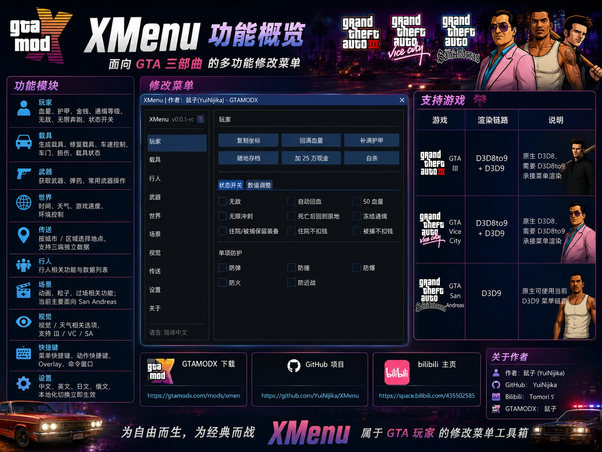

<div align="center">

# XMenu for GTA III / Vice City / San Andreas

一个简单但功能比较全面的 GTA 三部曲 ASI 菜单。  
By **鼠子(YuiNijika)**

A simple yet feature-rich ASI menu for GTA III, GTA Vice City, and GTA San Andreas.

[](https://github.com/YuiNijika/XMenu)
[](https://gtamodx.com/mods/xmenu)
[](https://space.bilibili.com/435502585)



</div>


**English** | [简体中文](README_zh.md)

---


> Default hotkey: `M` to open / close the menu

## About

XMenu is a simple yet feature-rich ASI menu for GTA III, GTA Vice City, and GTA San Andreas.  
It is designed to be easy to install, easy to use, and consistent across all three games.

You can install manually or use the bundled installer.  
Version string is `XMENU_VERSION` in source. In-game and installer update checks are available.

Author: **鼠子(YuiNijika)**

## Features

- Player: health, armor, money, wanted level, god mode, free fly, state toggles
- Vehicle: spawn, repair, speed, doors, damage, neon, vehicle state
- Weapon: grants, ammo, safe mode, scroll-wheel cycling, custom fire rate, wireframe and skeleton ESP, bullet tracking, wallhack
- World: time, weather, game speed, environment, freecam, top-down cam, random cheats
- Teleport: city / area locations, quick map / marker, forward teleport, continuous forward teleport
- Ped: spawn tools, data lists, no-fire control, spawn population limits
- Scene: animation, particle, cutscene tools
- Visual: visual / weather options
- UI: panel mode, list mode, popup numeric entry, shared themes
- Hotkeys: menu hotkey, action hotkeys, overlay, command window
- Settings: zh / en / jp / ru, config import/export, overlay, startup restore
- Updates: prefer [GTAMODX](https://gtamodx.com/mods/xmenu), fall back to GitHub Releases

### Weapon assist

- **Drawing**: ped / vehicle bounds, ColModel wireframes, ped skeleton
- **Bullet tracking**: configurable lock range and max targets; redirects bullet destination only, **does not rotate the camera**
- **Wallhack**: ignores buildings on the local player fire path
- **Custom fire rate**: independent from rapid-fire; can be saved to config
- **Safe mode**: blocks invalid weapon IDs by default
- GTA III is a stub for now; full tracking is for SA / VC

### UI modes

- **Panel mode**: classic window layout
- **List mode**: list navigation with keyboard, wheel, and mouse; popup numeric entry; collapsible groups
- Shared theme palette in settings

### San Andreas

Neon, freecam, top-down camera, random cheats, and many scene tools are SA-oriented. III / VC expose what each build implements.

### Per-game capability differences

| Capability | SA | VC | III |
| --- | :-: | :-: | :-: |
| Player basics (health / armor / money / god mode / sprint, etc.) | ✅ | ✅ | ✅ |
| Weapon (grant / drop / fire rate / stat overrides) | ✅ | ✅ | ✅ |
| World (time / weather / gravity / game speed / FPS / freeze time / faster clock / disable replay & cheats) | ✅ | ✅ | ✅ |
| Teleport | ✅ | ✅ | ✅ |
| Visual (HUD / radar / weather filter) | ✅ | ✅ | ✅ |
| Ped (spawn / attributes / big head) | ✅ | ✅ | ✅ |
| Bullet tracking / wallhack | ✅ | ✅ | ✖ |
| Ped / vehicle collision wireframe & skeleton drawing | ◐ | ◐ | ✖ |
| World pickups (spawn pickup) | ◐ | ◐ | ◐ |
| Player runtime effects / vehicle basics & colors | ✅ | ◐ | ◐ |
| Vehicle neon, freecam / top-down camera, random cheats, scene particles & cutscenes | ✅ | ✖ | ✖ |

> GTA III bullet tracking is a stub; on VC / III, ◐ means the page is available but some actions are limited.

## Supported games

| Game | Rendering path | Notes |
| --- | --- | --- |
| GTA III | D3D8to9 + D3D9 | D3D8to9 required |
| GTA Vice City | D3D8to9 + D3D9 | D3D8to9 required |
| GTA San Andreas | D3D9 | Native D3D9 |

## Requirements

- [DirectX End-User Runtime](https://www.microsoft.com/en-us/download/details.aspx?id=35)
- [Visual C++ Redistributable 2022 x86](https://aka.ms/vs/17/release/vc_redist.x86.exe)
- [Ultimate ASI Loader](https://github.com/ThirteenAG/Ultimate-ASI-Loader/releases)
- [SilentPatch](https://gtaforums.com/topic/669045-silentpatch/) recommended
- [D3D8to9](https://github.com/crosire/d3d8to9/releases) GTA III / Vice City only

## Installation

### Option A: Installer

1. Prepare the game install.
2. Run `XMenuInstaller.exe` and follow the wizard.
3. Optional components: ASI Loader, SilentPatch, D3D8to9, or XMenu only.
4. Before writing files, the installer validates `XBase\Mods\XMenu\package.json`, `engines.xbase`, the shared runtimes, the Panel bundle, and the WebUI against the current XBase layout.
5. Version info prefers GTAMODX; packages come from GitHub Releases.
6. Start the game and press `M`.

### Option B: Manual copy

1. Install requirements.
2. Copy `XMenuSA.asi` (matching your game: `XMenuVC.asi` / `XMenuIII.asi`) into the game's `plugins` folder (or game root).
3. Copy the `XBase` folder into the game root. It holds `Library\` (shared runtime and the WebView2 loader) and `Mods\XMenu\` (data, `ui.html`, and `package.json`).
4. For GTA III / Vice City, also copy `d3d8.dll`.
5. Start the game and press `M`.

Recommended layout:

```text
GameRoot/
├─ plugins/
│  ├─ XMenuSA.asi      (use the asi matching your game)
│  ├─ XMenuVC.asi
│  └─ XMenuIII.asi
├─ XBase/
│  ├─ Library/
│  │  ├─ XBaseSA.dll / XBaseVC.dll / XBaseIII.dll
│  │  └─ WebView2Loader.dll
│  └─ Mods/
│     └─ XMenu/
│        ├─ package.json    mod manifest, validated before mount
│        ├─ ui.html         React UI entry
│        └─ data/
│           ├─ sa/
│           ├─ vc/
│           ├─ iii/
│           └─ i18n/
└─ d3d8.dll
```

Runtime files:

```text
XBase/Mods/XMenu/config.json
XBase/Mods/XMenu/debug.log
```

`config.json` stores menu state, hotkeys, weapon assist, fire rate, and more.  
Startup is staged across frames; resource JSON loads on demand.

## Add a new language

Language files:

```text
XBase/Mods/XMenu/data/i18n/<language>/
```

Source:

```text
src/data/i18n/<language>/
```

Copy an existing language folder, update `index.json`, and translate JSON **values** only. Keep keys unchanged. Then rebuild or copy into the game folder.

## Build

Visual Studio, MSVC, Win32; [plugin-sdk](https://github.com/DK22Pac/plugin-sdk) via `PLUGIN_SDK_DIR`; `tools/premake5.exe`.

XBase headers and libs are staged into `include/XBase` and `lib` by XBase's own `Build.bat Release`; both sides must come from the same source and configuration.

The web UI needs Node.js: run `pnpm install && pnpm run build` inside `react/` first, it produces `react/dist/ui.html`.

```bat
Build.bat Release --no-pause
```

Optional: `Debug` / `Release`, `--toolset v143|v145`, `--no-pause`.  
`Setup.bat` helps with first-time setup.

Batch files must keep CRLF endings; `cmd` cannot find `call :label` targets when they are LF. `.gitattributes` pins `*.bat` to CRLF, re-checkout or convert before building if the local copy was changed.

A missing `react/dist` only warns and skips the web UI, the asi is still produced, but the React interface will not open.

Output:

```text
build/bin/XMenuSA.asi
build/bin/XMenuVC.asi
build/bin/XMenuIII.asi
build/bin/XMenuInstaller.exe
build/bin/XBase/Library/XBase{SA,VC,III}.dll
build/bin/XBase/Mods/XMenu/package.json
build/bin/XBase/Mods/XMenu/ui.html
build/bin/XBase/Mods/XMenu/data/**
build/bin/XBase/Mods/XMenu/data/i18n/**
```

| Path | Purpose |
| --- | --- |
| `tools/build_i18n_split.py` | Maintain i18n data |
| `tools/check_ui_registry.py` | Validate registry ids against bridge methods, run it after editing `ui-schema.json` |
| `tools/dataEditor/` | Python data editor |
| `tools/build_plugin_sdk.bat` | Build plugin-sdk |
| `tools/resolve_vc_toolset.ps1` | Resolve MSVC toolset |

## Source layout

```text
XMenu/
├─ src/
│  ├─ app/            startup and lifecycle orchestration
│  ├─ controllers/    UI registry, bridge, feature logic
│  ├─ ui/             ImGui pages and sections
│  ├─ integration/    XBase adapter layer
│  ├─ game/ universal/ utils/ resources/
│  ├─ data/           i18n, per-game resources, ui-schema.json, package.json
│  └─ main.cpp
├─ react/             React web UI source
├─ installer/
├─ include/XBase/     XBase public headers (staged by XBase build)
├─ lib/               XBase and plugin-sdk static libs
├─ tools/
├─ Build.bat / Setup.bat / premake5.lua
└─ images/
```

`src/data/ui-schema.json` is the single description shared by the ImGui and React surfaces. Run `tools/check_ui_registry.py` after changing it.

## Links

- GitHub: [YuiNijika/XMenu](https://github.com/YuiNijika/XMenu)
- GTAMODX: [XMenu page](https://gtamodx.com/mods/xmenu)
- Bilibili: [Tomoriゞ](https://space.bilibili.com/435502585)
- QQ Group: [GTAMODX QQ Group](https://gtamodx.com/qqun)

> XMenu is free. Reselling or commercial redistribution is not allowed.
